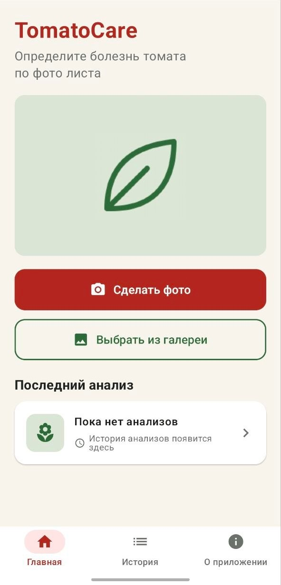
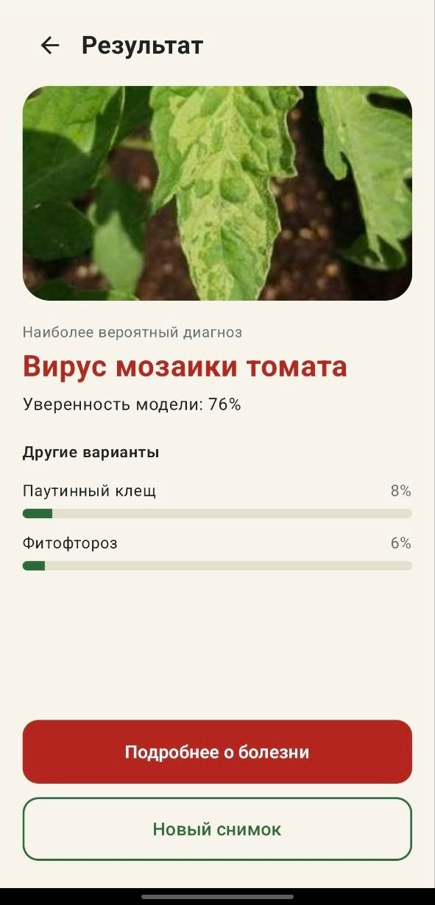

# TomatoCare

Android-приложение, которое определяет болезни томатов по фотографии листа. Сделайте снимок или выберите фото из галереи — через секунду вы увидите, здоров ли лист, а если нет, то чем он, скорее всего, поражён и насколько модель в этом уверена.

Нейросеть работает прямо на телефоне: интернет не нужен, фотографии никуда не отправляются.

<table>
  <tr>
    <td align="center">
      <!-- Скриншот главного экрана: положите файл в docs/screenshots/home.png -->
      <br>
      <sub>Главный экран</sub>
    </td>
    <td align="center">
      <!-- Скриншот экрана результата: положите файл в docs/screenshots/result.png -->
      <br>
      <sub>Результат анализа</sub>
    </td>
  </tr>
</table>

## Возможности

- съёмка листа камерой или выбор фото из галереи;
- распознавание 10 состояний листа: 9 заболеваний и здоровый лист;
- вывод названия состояния и уверенности модели в процентах;
- описание выявленного заболевания;
- полностью автономная работа без интернета.

## Быстрый старт

Нужны Android Studio и устройство или эмулятор с Android. Минимальную версию Android и версию JDK смотрите в `app/build.gradle.kts`.

```bash
git clone github.com/zen256/TomatoCare
```

1. Откройте папку `TomatoCare` в Android Studio и дождитесь синхронизации Gradle.
2. Проверьте, что в `app/src/main/assets/` лежат `efficientnet_b0.onnx` и `classes.json` (в репозитории они уже есть).
3. Выберите устройство и нажмите **Run**.

Либо соберите APK из консоли:

```bash
./gradlew assembleDebug
```

Готовый файл будет в `app/build/outputs/apk/debug/`.

## Как пользоваться

1. Откройте приложение и перейдите к выбору фото.
2. Сделайте снимок листа или выберите изображение из галереи.
3. Нажмите «Определить».
4. Посмотрите результат и при желании откройте описание заболевания.

Для лучшего результата снимайте один лист крупным планом, при хорошем освещении, без размытия. Подробный сценарий и описание экранов: [`docs/user_scenario.md`](docs/user_scenario.md).

## Что распознаётся

| Состояние | Природа |
|---|---|
| Бактериальная пятнистость | бактериальная |
| Ранняя пятнистость (альтернариоз) | грибная |
| Фитофтороз | оомицет (грибоподобный организм) |
| Кладоспориоз (бурая пятнистость) | грибная |
| Септориоз | грибная |
| Паутинный клещ | вредитель |
| Мишеневидная пятнистость | грибная |
| Вирус жёлтой курчавости листьев | вирусная |
| Вирус мозаики томата | вирусная |
| Здоровый лист | — |

Технические названия классов и их порядок описаны в [`docs/dataset.md`](docs/dataset.md).

## Датасет

22 524 фотографии листьев томата в 10 классах, разделённые на обучающую, валидационную и тестовую выборки (15 762 / 3 373 / 3 389). Источник: https://www.kaggle.com/datasets/ashishmotwani/tomato. Сами изображения в репозиторий не входят.

Состав классов, подготовка данных и известные особенности набора — в [`docs/dataset.md`](docs/dataset.md).

## Модель и качество

Используется EfficientNet-B0, предобученная на ImageNet и дообученная на томатах. Вход — изображение 224 × 224, выход — вероятности по 10 классам. В приложение модель встроена в формате ONNX и запускается через ONNX Runtime.

| Метрика на тестовой выборке | Значение |
|---|---|
| Accuracy | 98,6 % |
| Macro F1 | 0,988 |
| Самый слабый класс (F1) | септориоз, 0,968 |

Цифры получены на снимках из того же набора, что и обучение. На реальных фото с другим фоном, освещением и камерой точность может быть ниже.

Подробности — в [`docs/model.md`](docs/model.md).

### Переобучение модели

Нужен Python с `torch`, `torchvision`, `scikit-learn` и `matplotlib`. Обучение запускается из папки с датасетом (подпапки `train/`, `valid/`, `test/`):

```bash
python ml/train.py         # обучение, сохранение весов и classes.json
python ml/export_onnx.py   # экспорт в ONNX одним файлом
```

После экспорта скопируйте `efficientnet_b0.onnx` и `classes.json` в `app/src/main/assets/`. Порядок классов в `classes.json` должен совпадать с порядком выходов модели.

## Ограничения

- Поддерживается только томат и только перечисленные состояния. Лист другой культуры или болезнь, которой нет в списке, модель отнесёт к ближайшему известному классу.
- Результат справочный и не заменяет консультацию агронома.
- Низкая уверенность модели — повод перепроверить результат или переснять фото.

## Планы

- предупреждения о плохом качестве фото (размытие, тёмный или светлый снимок, малое разрешение);
- история анализов;
- улучшенная версия модели.

## Документация

- [Пользовательский сценарий](docs/user_scenario.md)
- [Датасет](docs/dataset.md)
- [Модель](docs/model.md)
- [Отчёты о разработке](docs/reports/)