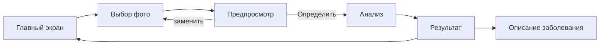

# Пользовательский сценарий

Документ описывает, как пользователь работает с TomatoCare, какие экраны есть в приложении и что входит в минимально рабочую версию.

## Для кого

Для человека, который выращивает томаты (на огороде, в теплице, дома) и хочет быстро понять, чем может быть поражён лист, не дожидаясь консультации специалиста.

## Основной сценарий

1. Пользователь открывает приложение и попадает на главный экран.
2. Переходит к выбору фото: делает снимок листа камерой или выбирает готовое изображение из галереи.
3. Выбранное изображение отображается на экране. Если фото не подходит, пользователь заменяет его другим.
4. Нажимает «Определить».
5. Приложение анализирует изображение прямо на устройстве.
6. На экране результата показываются название состояния листа и уверенность модели.
7. По желанию пользователь открывает описание найденного заболевания.
8. Возвращается назад и анализирует следующее фото.

## Экраны

| Экран | Назначение |
|---|---|
| Главный | точка входа, переход к анализу нового фото |
| Выбор фото | съёмка камерой или выбор из галереи, предпросмотр, замена фото |
| Анализ | индикация обработки изображения моделью |
| Результат | распознанный класс и уверенность в процентах |
| Описание заболевания | краткая информация о выявленном состоянии |

## Что получает пользователь

- Название состояния листа из списка 10 классов (9 заболеваний и «здоровый»).
- Уверенность модели в процентах. Чем она ниже, тем осторожнее нужно относиться к результату.

## Рекомендации по съёмке

- Один лист в кадре, крупным планом, поражённая область видна чётко.
- Дневной или равномерный свет, без сильных теней и бликов.
- Фото не размыто.

## Минимально рабочая версия

Входит:

- выбор или съёмка фотографии и замена выбранного фото;
- запуск анализа по кнопке;
- вывод класса и уверенности;
- работа без интернета.

Пока не входит (запланировано):

- предупреждения о плохом качестве фото (размытие, затемнение, малое разрешение);
- особая обработка результатов с низкой уверенностью и неизвестных случаев;
- история анализов.
